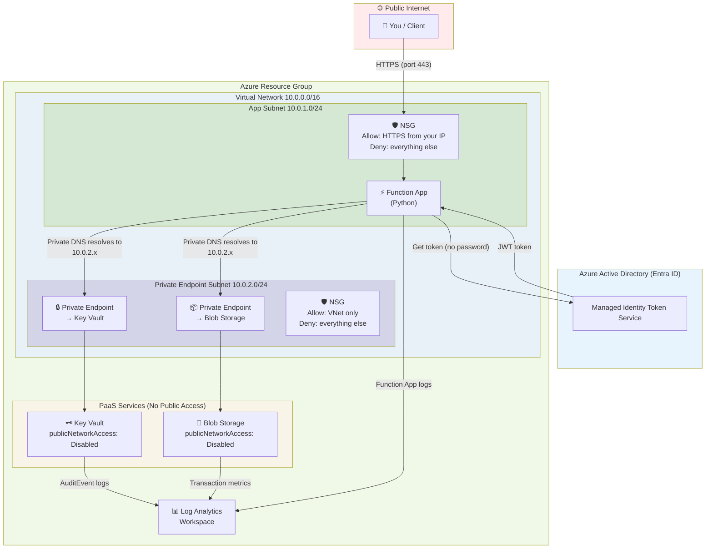
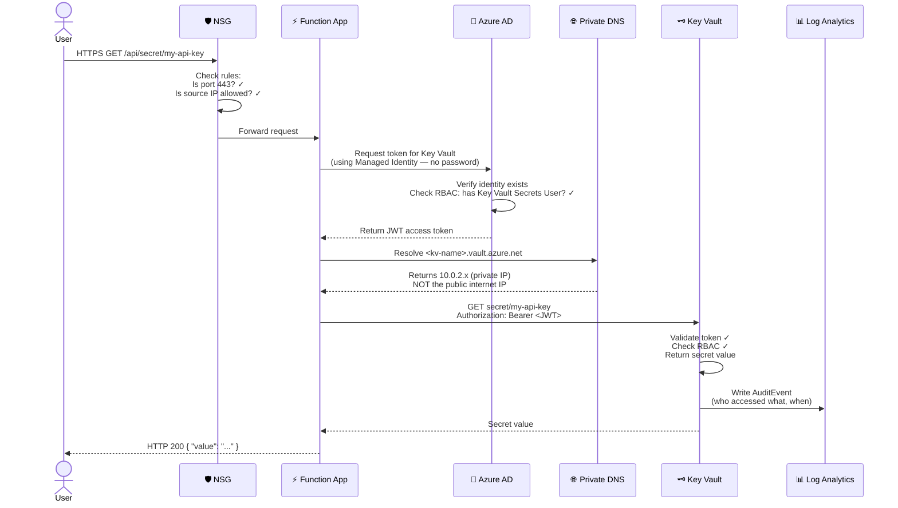
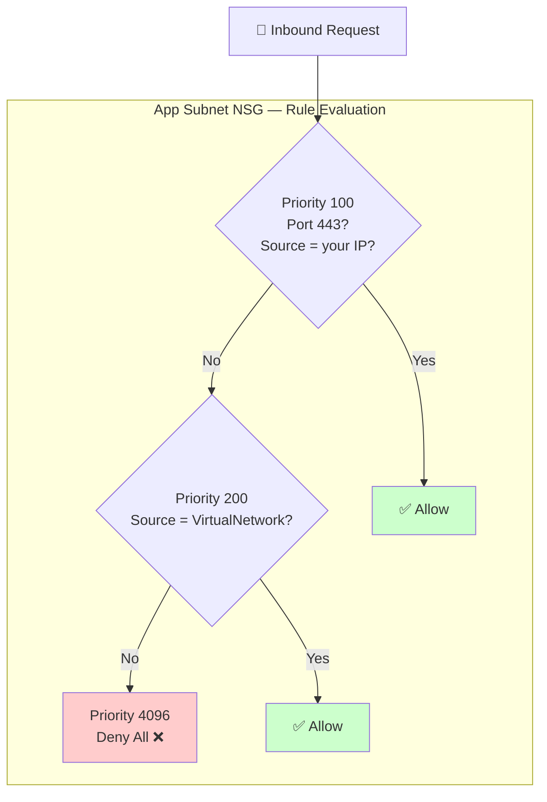
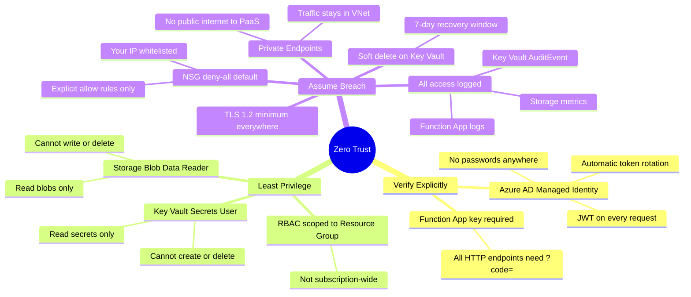
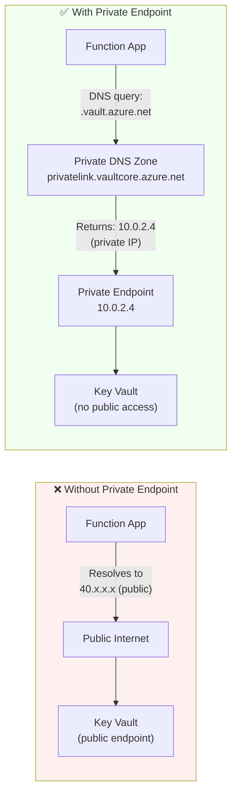
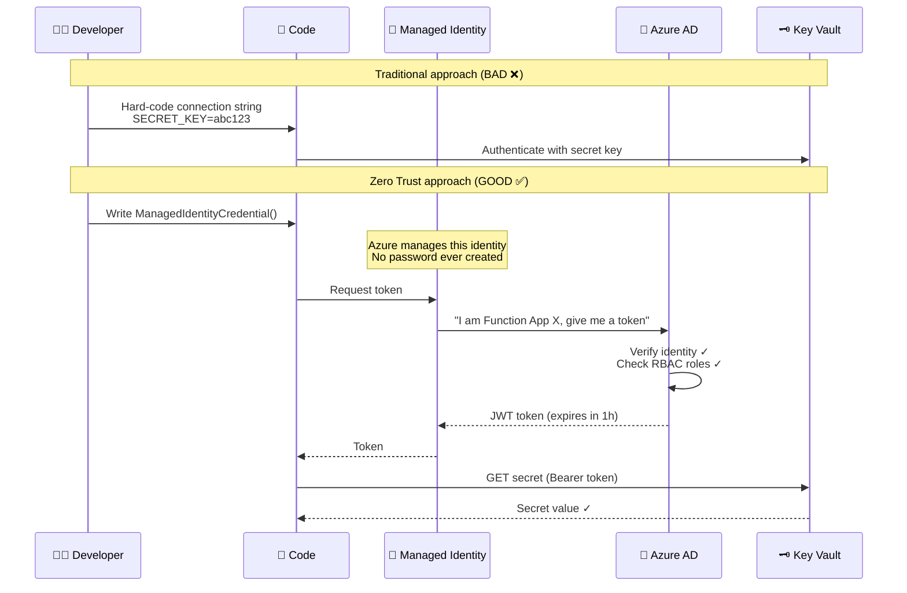
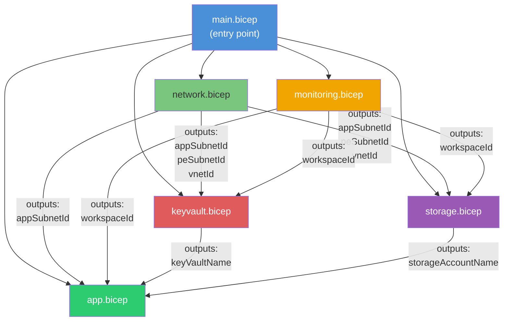
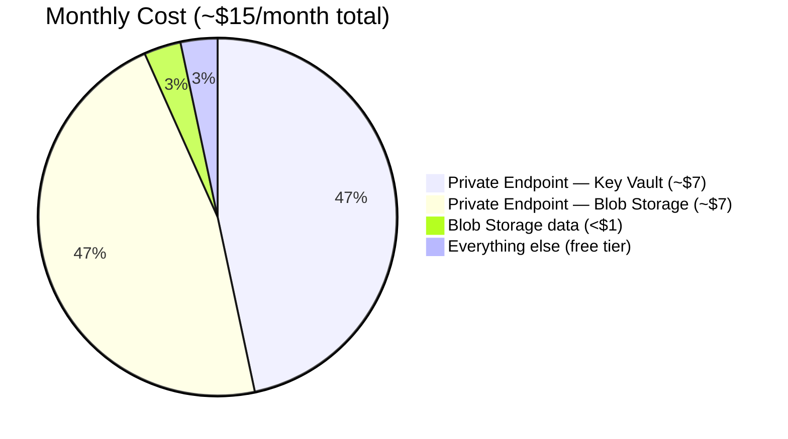

# Architecture Diagrams

---

## 1. Overall Architecture

---

## 2. Request Flow — Reading a Secret

Step-by-step what happens when you call `GET /api/secret/my-api-key`:

---

## 3. Network Security — NSG Rule Evaluation

NSG rules are evaluated **lowest priority number first**. First match wins.

---

## 4. Zero Trust Principles Mapping

---

## 5. Private Endpoint DNS Resolution

How the Function App reaches Key Vault without going through the public internet:

---

## 6. Managed Identity — No Passwords Flow

---

## 7. Bicep Module Dependency Graph

How the Bicep templates depend on each other:

---

## 8. Cost Breakdown

